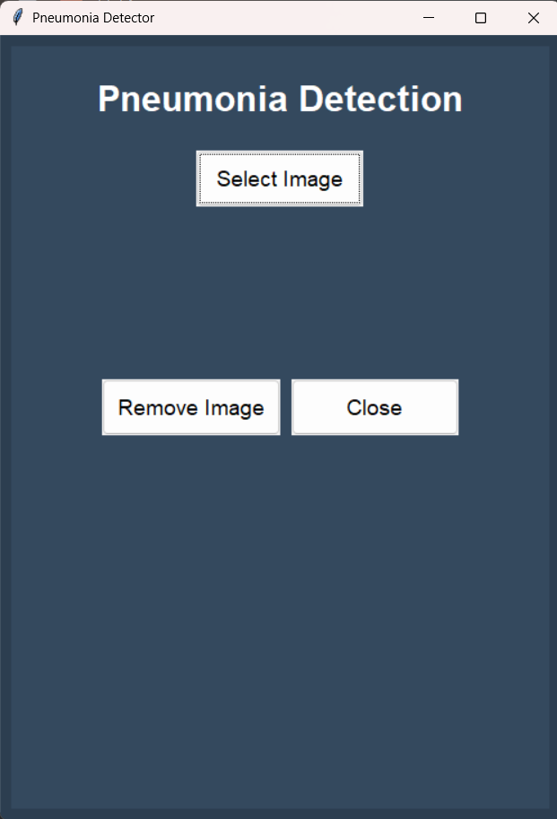

# Pneumonia Detection App

This repository contains a Python application designed for pneumonia detection using machine learning models. The app utilizes the Tkinter library for a user-friendly graphical interface and provides functionalities for model management, image uploads, and model-based predictions. It includes multiple pre-trained models for pneumonia detection: CNN, MobileNetV2, and VGG16.


## Screenshot


## Features

- **Image Upload**: Upload an image of the chest X-ray for detection.
- **Model Selection**: Choose between various models (CNN, MobileNetV2, and VGG16) for prediction.
- **Model Management**: Add, remove, and select models for prediction.
- **Model Saving**: Models can be saved in Python (.py) files for easy reuse and management.
- **Database Integration**: Ability to connect with a database for saving model predictions or image metadata.


## Requirements

- Python 3.x
- Tkinter
- TensorFlow
- Keras
- SQLite (for database integration)

## Installation

1. Clone the repository:
   ```bash
   git clone https://github.com/yourusername/pneumonia-detection.git
   ```

2. Install the necessary dependencies:
   ```bash
   pip install -r requirements.txt
   ```

3. Run the application:
   ```bash
   python app.py
   ```

## Usage

1. **Upload Image**: Select an image of a chest X-ray to be analyzed.
2. **Select Model**: Choose from CNN, MobileNetV2, or VGG16 models for detection.
3. **Prediction**: Once the model is selected, the app will predict whether the X-ray shows signs of pneumonia.
4. **Database Access**: View or store results in the database.

## Models Available

- **CNN**: Convolutional Neural Network for pneumonia detection.
- **MobileNetV2**: A lightweight neural network for real-time predictions.
- **VGG16**: A deep learning model for image classification, suitable for detecting pneumonia in X-rays.

## Contributing

Feel free to fork this repository, submit issues, or create pull requests for improvements. If you encounter any issues, please create a detailed bug report.

## License

This project is licensed under the MIT License.
